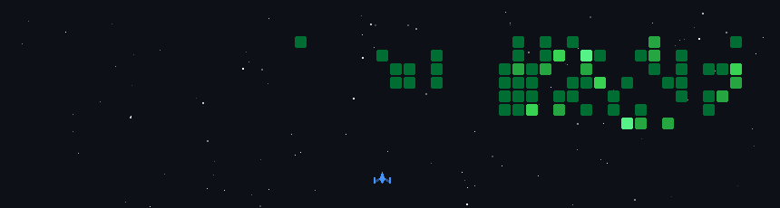

 

  

---

## 👨‍💻 Construyo software que resuelve problemas reales

Soy estudiante de **Ingeniería en Desarrollo de Software en la UTLD** y cofundador de **Comar-K Tecnología**. Desarrollo productos web completos para negocios de La Laguna: convierto procesos manuales en sistemas claros, rápidos y utilizables.

Trabajo de extremo a extremo —base de datos, backend, frontend y despliegue— en soluciones como puntos de venta, inventarios, CRM, catálogos digitales, pedidos y automatizaciones.

- 🔭 Mantengo **5 productos en producción** utilizados por negocios reales.
- 🧩 Mi stack principal es **React, TypeScript, Supabase y Vercel**.
- ⚙️ También desarrollo aplicaciones de escritorio, PWA y flujos con **n8n**.
- 🌙 Disponible para colaborar en horario vespertino y nocturno.

## 🛠️ Stack principal

  

## 🚀 Trabajo destacado

### 🔩 Ferretería Solap

> Catálogo de **más de 15,000 productos**, panel administrativo en tiempo real, experiencia PWA y flujo de pedidos por WhatsApp.

`React` · `TypeScript` · `Supabase` · `PWA`  
[Visitar proyecto →](https://ferreteria-solap.vercel.app)

### 🍽️ Restaurante San José

> Punto de venta y menú digital con dominio propio, desarrollado para operar diariamente dentro del negocio.

`React` · `TypeScript` · `Supabase`  
[Visitar proyecto →](https://restaurantesanjose.com)

### 🏢 Comar-K Tecnología

> Sitio de la empresa de desarrollo web que cofundé para ayudar a negocios a digitalizar y automatizar sus operaciones.

`React` · `TypeScript` · `Supabase`  
[Visitar proyecto →](https://comar-k.com)

<strong>Ver otros sistemas desarrollados</strong>

 

- **Ferretería La Conse:** POS multiportal con aplicación Electron y funcionamiento offline, desarrollado como tesis UTLD.
- **Material Eléctrico de La Laguna:** sistema privado de facturación e inventario para más de 1,050 productos.

## 👾 Actividad en modo arcade

Mi gráfica de contribuciones convertida en una batalla espacial. Se actualiza automáticamente cada día mediante GitHub Actions.

---

### ¿Tienes una idea o un proceso que quieras digitalizar?

Puedo ayudarte a convertirlo en un producto web funcional y listo para producción.

  

Comar-K Tecnología · Software real para negocios reales

